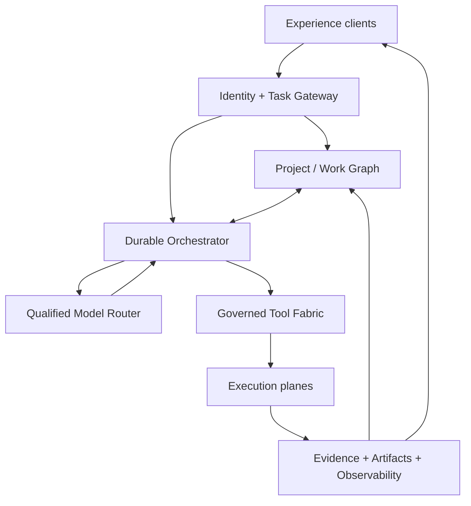
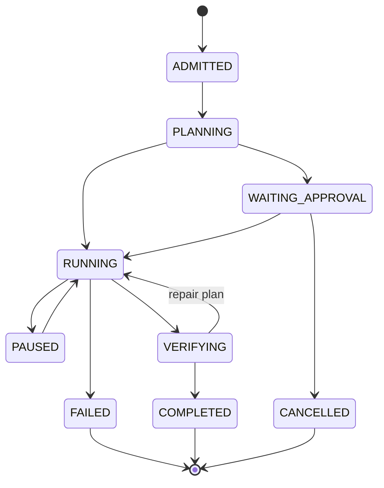

# AR-01 Canonical Architecture

## Decision

MUSITU Axiom will converge on one provider-neutral, evidence-native execution
platform identified internally as `MUSITU_AXIOM_UNIFIED_V1`. V3, Frontier V5,
the legacy browser application, and FA-06–FA-20 remain visible component
lineages. The platform identifier does not overwrite their qualification truth.

The architectural objective is not a larger interface. It is a single path from
user intent to a durable, governed, observable result:

No client, model, tool, or execution plane may bypass task admission, policy,
durable state, or receipts.

## Layer responsibilities

### 1. Experience clients

The browser application, mobile/PWA, developer interface, MCP, and future
connectors are clients of the same contracts. They may render previews, request
tasks, show events, collect approvals, edit artifacts, and maintain an offline
replica. They do not own execution truth or grant themselves authority.

The existing broad surfaces are preserved. Recovery must connect them to the
platform incrementally instead of replacing them with a thin chat page.

### 2. Identity and Task Gateway

The gateway authenticates the session, resolves actor/tenant/project scope,
applies admission and rate policy, validates a `TASK_REQUEST`, assigns the trace,
and writes the request durably before acknowledging it. Every downstream call
receives a short-lived identity context; raw browser credentials do not propagate
to execution planes.

### 3. Project / Work Graph

This is the server system of record for projects, objects, relationships, memory,
source references, artifacts, versions, comments, and task linkage. Existing
IndexedDB stores become an offline replica and cache, not the only authoritative
copy. Sync uses explicit versions and conflicts; governed objects never use
silent last-writer-wins.

The first implementation may use an environment-isolated relational store with
an append-only event table and object storage. The contract must permit later
storage changes without altering client or orchestration semantics.

### 4. Durable Orchestrator

The orchestrator owns task and plan state. It persists each state transition,
leases executable steps, renews or releases leases, records checkpoints, retries
only retry-safe work, routes permanent failures to a dead-letter state, and
resumes after disconnect, deploy, or worker termination.

Minimum task state machine:

Steps have their own monotonic state, attempt counter, idempotency key, lease,
input/output digest, receipt, and acceptance-test result. Streaming is a view of
durable events, never the storage mechanism.

### 5. Qualified Model Router

The router chooses a model separately for planning, synthesis, classification,
verification, and recovery. Decisions consider qualification state, policy,
data class, latency, cost ceiling, context size, and required tools. Every route
and fallback is receipted.

The baseline must work without customer-funded keys:

- deterministic planners and specialized engines for tasks they can solve;
- Cloudflare Workers AI or another available low/no-cost hosted route where
  policy and account entitlements allow it;
- local/open models where operationally feasible;
- explicit `BLOCKED_NO_QUALIFIED_ROUTE` rather than invented output.

Paid providers are optional adapters. Adding one may improve quality but may not
become the only path for core product operation.

### 6. Governed Tool Fabric

Every V3 operation, qualified Frontier V5 capability, research action, artifact
operation, automation, computer/live action, and connector is registered as a
versioned `TOOL_DESCRIPTOR`. The fabric validates arguments, actor/project
scopes, qualification, environment, risk, budget, idempotency, and approvals
before dispatch.

Frontier V5 integration is exhaustive by ledger: each capability is preserved
and assigned one of `QUALIFIED_EXECUTABLE`, `IMPLEMENTED_NOT_QUALIFIED`,
`REGISTERED_TARGET_ONLY`, or `DEFERRED_WITH_REASON`. Registry presence never
silently becomes execution authority.

### 7. Execution planes

Execution is split by trust and workload, while all planes implement the same
invocation and receipt contracts:

| Plane | Initial contents | Isolation requirement |
|---|---|---|
| Quantitative | Existing V3 74-operation runtime | Protected service binding; typed adapter |
| Frontier | Qualified Frontier V5 runtime modules and skills | Per-capability allowlist and dependencies |
| Research | Retrieval, source capture, claim graph, contradiction handling | Egress and source policy; content as data |
| Artifact | Documents, sheets, presentations, sites, dashboards | Sandboxed rendering and immutable versions |
| Computer / Live | Browser or remote-computer actions and live sessions | Highest-risk plane; explicit approvals and recording |
| Connectors | MCP and external SaaS/data services | Least privilege, tenant-scoped credentials, revocation |

No plane may assert task completion. It returns a signed or digest-bound receipt;
the orchestrator checks the plan acceptance criteria.

### 8. Evidence, artifacts, and observability

Every task produces one evidence envelope that binds identity, project version,
plan versions, model route decisions, approvals, tool receipts, artifacts,
limitations, costs, timings, retries, and acceptance results. Evidence is
append-only and hash-linked. Corrections supersede earlier records rather than
rewriting history.

Operational telemetry and user evidence are related but not identical. Logs and
traces must redact secrets and sensitive payloads while retaining correlation.
User-visible receipts expose meaningful progress and proof without exposing
internal credentials or private chain-of-thought.

## Full-connection acceptance trace

The phrase **full connection** is reserved for a tested end-to-end trace that
meets every row below on one exact candidate and isolated environment:

| Gate | Required observable result |
|---|---|
| Admission | Authenticated actor, tenant, project, task, acceptance tests, and idempotency are durably recorded |
| Context | Server project version and authorized memory are loaded; client-only state is not treated as canonical |
| Planning | A versioned plan contains at least three dependent steps and at least two distinct qualified tools |
| Routing | Model/tool choices show qualification, policy, budget, and fallback decisions |
| Approval | A consequential step pauses and cannot run until an exact-scope approval is recorded |
| Durability | Client disconnect plus worker/process restart does not lose the task; execution resumes exactly once |
| Execution | V3 and at least one non-V3 qualified capability execute through the same tool fabric |
| Evidence | Every call has a receipt; inputs/outputs and artifacts are digest-bound; limitations remain visible |
| Acceptance | Machine checks evaluate the requested outcome, not merely HTTP success |
| Artifact | A usable versioned artifact is attached to the project and can be rolled back non-destructively |
| Cross-device | A second authorized client sees the same task, approvals, progress, and artifact from server truth |
| Recovery | A forced transient failure retries safely; a permanent failure fails closed with diagnostic evidence |

A demo that omits any row must be described as partial and name the missing row.

## Data and environment isolation

Development, staging, canary, and production have distinct databases, object
storage, queues/workflows, service bindings, secrets, and identity audiences.
Staging and canary use synthetic or explicitly scrubbed fixtures. Production data
is never used as a convenience test fixture. Promotion moves immutable code and
schemas, not live data backward into a lower environment.

Schema migrations use expand/migrate/contract:

1. expand with backward-compatible tables/columns and dual-read support;
2. migrate verified copies with counts, digests, and quarantine for failures;
3. switch reads only after shadow comparison passes;
4. retain rollback compatibility for the defined observation window;
5. contract old schema only under a separate destructive-change approval.

## Security and authority invariants

- Models and retrieved content have no inherent authority.
- Tool arguments are validated after model output and before policy evaluation.
- Approval binds the exact argument digest and expires; changed arguments require
  new approval.
- Secrets remain in the executing plane and are never returned to the client,
  model prompt, receipt payload, or artifact.
- All external actions use tenant-scoped least-privilege credentials.
- High-risk actions support cancellation and, where possible, compensating
  rollback.
- Production credentials are absent from independent verification jobs.
- Builders cannot self-certify release authority.

## Performance and product-quality objectives

Recovery is intended to create measurable product advantage, not declare it.
Initial engineering targets are:

- task admission acknowledgement p95 at or below 750 ms under the stated load;
- user-visible durable event within 2 seconds of each state transition;
- zero duplicate side effects across retry/restart fault injection;
- 100% receipt coverage for executed tool steps;
- 100% approval enforcement for configured consequential tools;
- successful resume after client disconnect, orchestrator restart, and deploy;
- project/artifact visibility on a second authorized client after synchronization;
- published cost, latency, success, and acceptance metrics by task class.

Claims of outperforming Astra, DeepMind, Anthropic, Microsoft, or any other system
require a separately approved external-comparison protocol, representative tasks,
reproducible evidence, current baselines, and honest limitations. They are not an
AR-01 deliverable.

## AR-02 entry conditions

Implementation may begin only after a new explicit authorization and all of the
following are fixed: isolated non-production resources, canonical schema
ownership, queue/orchestrator choice, first vertical task, acceptance test,
credential-free model route, and rollback target. AR-00/AR-01 approval alone is
not reusable for AR-02.
